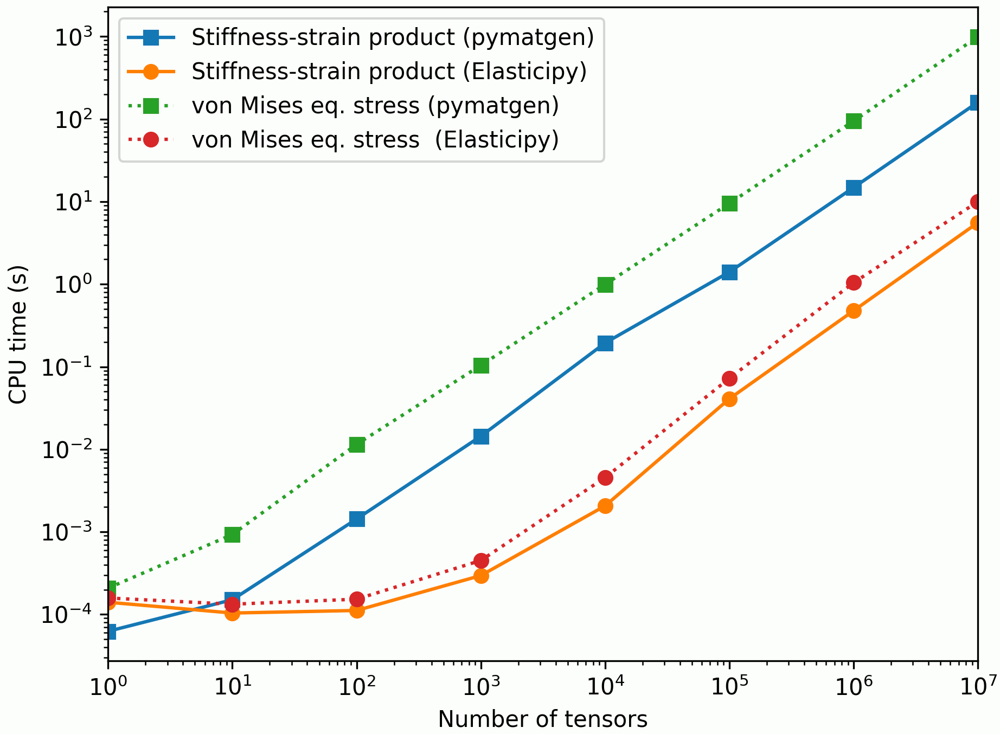

# Summary

Elasticipy is a Python package designed to simplify the analysis of material elasticity properties. It enables the 
computation, visualization, and analysis of elasticity tensors while incorporating crystal symmetries. By targeting a 
diverse audience, Elasticipy is suitable for researchers, engineers, and educators looking to explore elastic behavior 
in materials. It is easy to install via PyPI and offers robust documentation, practical tutorials, and a user-friendly 
interface. 

# Statement of Need

Materials elasticity analysis is crucial in fields such as materials science, physics, and engineering. Elasticity 
tensors, which govern the stress-strain relationships in materials, are complex to compute and analyze, especially when 
accounting for crystal or material symmetries. Existing software solutions often lack accessibility or do not fully 
support complex symmetry operations, making them challenging for non-specialist users or those seeking rapid prototyping
and analysis.

Elasticipy addresses this gap by providing:

  - Intuitive Python-based APIs for defining and manipulating elasticity tensors.

  - Support for standard crystal symmetry groups [@nye] to facilitate the definition of stiffness/compliance components. 

  - Visualization tools for understanding directional elastic behavior.

Unlike other software such as pymatgen [@pymatgen] or Elate [@elate], Elasticipy emphasizes ease of use, flexibility, 
and integration with existing Python workflows. Its modular design and comprehensive documentation make it accessible 
for both experts and non-specialists. In addition, it introduces the concept of *tensor arrays*, allowing to process 
thousands of tensors at once (e.g. rotation of tensors) in a user-friendly and highly efficient way, in a similar way as
in MTEX [@pymatgen]. In order to highlight the performances of Elasticipy, \autoref{fig:compa} shows CPU required to 
compute the stress from the elastic strain (through the fourth-order stiffness tensor) and that for evaluating the von 
Mises equivalent stress, as a function of the number of tensors to consider. This evidences that basic operations on 
tensors is 1 to 2 orders of magnitude faster when using Elasticipy than when using pymatgen implementation.

{ width=75% }

Nevertheless, as tensor algebra is not the core of pymatgen, efforts have been made to allow conversions from pymatgen 
to Elasticipy, and vice versa.

# References