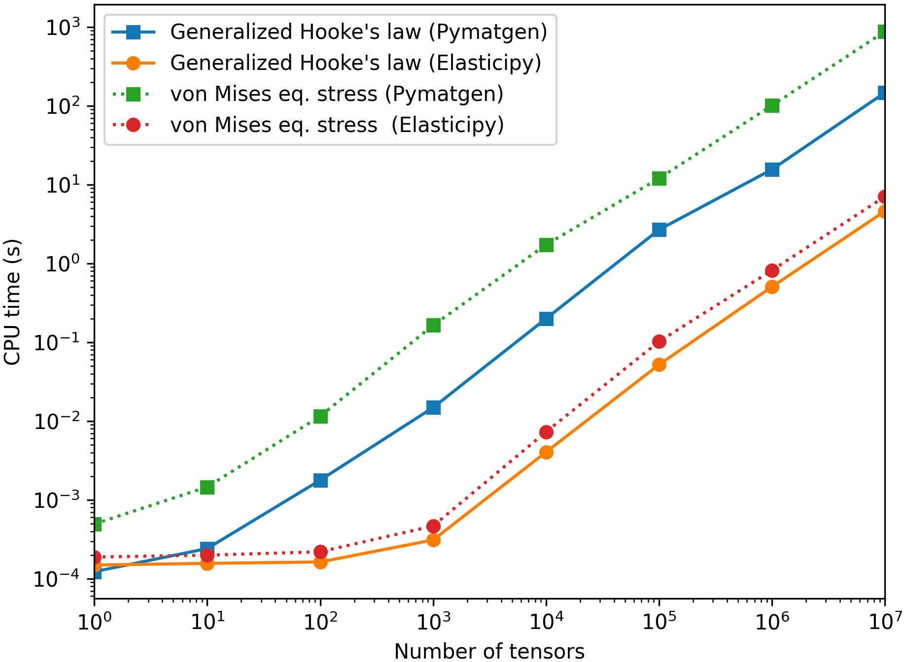

# Summary

Elasticipy is a Python library designed to streamline the computation of elasticity tensors for materials and 
crystalline materials, taking their specific symmetries into account. It provides tools to manipulate, visualize, and 
analyze these tensors, simplifying workflows for materials scientists an engineers.

# Statement of Need

In continuum mechanics, the deformation of a material is described by the second-order strain tensor (usually denoted 
$\boldsymbol{\varepsilon}$) whereas the stress is described by the second-order Cauchy's stress tensor 
($\boldsymbol{\sigma}$). Under the linear elasticity assumption, the relationship between $\boldsymbol{\varepsilon}$
and $\boldsymbol{\sigma}$ is given through the fourth-order stiffness tensor $\boldsymbol{C}$ with:

$$\sigma_{ij}=C_{ijk\ell}\varepsilon_{k\ell}$$

where $C_{ijk\ell}$ denotes the $ijk\ell$-th component of $\boldsymbol{C}$. In order to simplify the above equation, one usually uses the so-called Voigt notation, 
which reads:
$$\begin{bmatrix}
\sigma_{11}\\
\sigma_{22}\\
\sigma_{33}\\
\sigma_{23}\\
\sigma_{13}\\
\sigma_{12}
\end{bmatrix}
=
\begin{bmatrix}
C_{1111}    & C_{1122}      & C_{1133}  & C_{1123} & C_{1113}  & C_{1112}\\
            & C_{2222}      & C_{2233}  & C_{2223} & C_{2213}  & C_{2212}\\
            &               & C_{3333}  & C_{3323} & C_{3313}  & C_{3312}\\
            &               &           & C_{2323} & C_{2313}  & C_{2312}\\
            & \mathrm{sym.} &           &          & C_{1313}  & C_{1312}\\
            &           &               &          &           & C_{1212}\\
\end{bmatrix}
\begin{bmatrix}
\varepsilon_{11}\\
\varepsilon_{22}\\
\varepsilon_{33}\\
2\varepsilon_{23}\\
2\varepsilon_{13}\\
2\varepsilon_{12}
\end{bmatrix}
$$

The values of $\boldsymbol{C}$ depend on the material, whereas its shape (set of zero-components, or linear relationships 
between them) depends on the material's symmetry [@nye]. 

Existing software solutions often lack accessibility or do not fully support complex symmetry operations, making them 
challenging for non-specialist users or those seeking rapid prototyping and analysis. Elasticipy addresses this gap by 
providing:

  - intuitive Python-based APIs for defining and manipulating second- and fourth-order tensors, such as strain, stress
and stiffness;

  - support for standard crystal symmetry groups [@nye] to facilitate the definition of stiffness/compliance components; 

  - visualization tools for understanding directional elastic behavior (Young modulus, shear modulus and Poisson ratio);

  - a collection of built-in methods to easily and efficiently perform fundamental operations on tensors (rotations, 
products, invariants, statistical analysis etc.).

Unlike other software such as pymatgen [@pymatgen] or Elate [@elate], Elasticipy emphasizes ease of use, flexibility, 
and integration with existing Python workflows. In addition, it introduces the concept of *tensor arrays*, in a similar 
way as in MTEX [@MTEX], allowing to process thousands of tensors at once with simple and highly efficient commands. In 
order to highlight the performances of Elasticipy, \autoref{fig:compa} shows the wall-time required to perform two basic 
operations on tensors, as functions of the number of considered tensors. This evidences that, when processing large 
number of tensors ($>10^3$), basic operations on tensors are 1 to 2 orders of magnitude faster when using Elasticipy 
than pymatgen. These performances are reached by taking advantage of `numpy`'s array 
broadcasting.

{ width=75% }

Nevertheless, as tensor algebra is not the core of pymatgen, Elasticipy supports conversion to pymatgen, and vice versa,
allowing to work with these packages altogether. Elasticipy also allows direct imports of elastic data from 
[the Materials Project](https://next-gen.materialsproject.org/) [@MaterialsProject].

# References